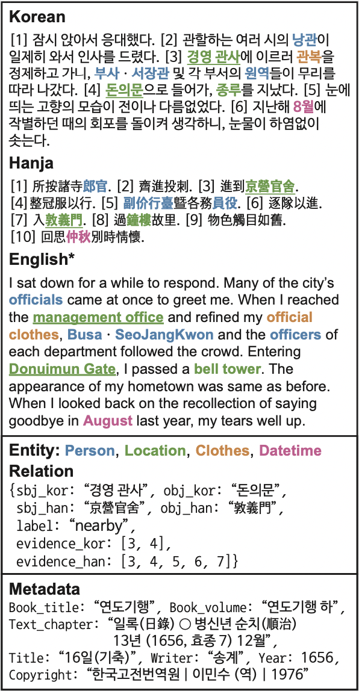

This is the official code for **HistRED: A Historical Document-Level Relation Extraction Dataset** (ACL 2023).
All materials related to this paper can be found here.
- [ACL Anthology](https://aclanthology.org/2023.acl-long.180/): Official proceeding publication
- [Virtual-ACL 2023](https://virtual2023.aclweb.org/paper_P536.html#slides): You can view papers, posters, and presentation slides.
- [arXiv](https://arxiv.org/abs/2307.04285): This is the camera-ready version, which is a key part of this paper.

Note that this dataset is open under [CC BY-NC-ND 4.0](https://creativecommons.org/licenses/by-nc-nd/4.0/) license. 
The dataset exists in [HuggingFaceDataset](https://huggingface.co/datasets/Soyoung/HistRED).

```python
from datasets import load_dataset

dataset = load_dataset("Soyoung/HistRED")
```

# Dataset Example
Due to the complexity of the dataset, we replace the dataset preview with an example figure.
The text is translated into English for comprehension (*), however, unlike the figure, the dataset does not include English-translated text, only containing Korean and Hanja.
Also, only one relation is shown for readability. 

Relation information includes (i) subject and object entities for Korean and Hanja *(sbj_kor, sbj_han, obj_kor, obj_han)*, (ii) a relation type (label), 
(iii) evidence sentence index(es) for each language (evidence_kor, evidence_han). 
Metadata contains additional information, such as which book the text is extracted from.



# Corpus of HistRED: \<\< Yeonhaengnok \>\> 
In this dataset, we choose *Yeonhaengnok*, a collection of records originally written in Hanja, classical Chinese writing, which has later been translated into Korean.
[Joseon](https://en.wikipedia.org/wiki/Joseon), the last dynastic kingdom of Korea, lasted just over five centuries, from 1392 to 1897, and many aspects of Korean traditions and customs trace their roots back to this era.
Numerous historical documents exist from the Joseon dynasty, including *Annals of Joseon Dynasty* ([AJD](https://en.wikipedia.org/wiki/Veritable_Records_of_the_Joseon_Dynasty)) and *Diaries of the Royal Secretariats* ([DRS](https://en.wikipedia.org/wiki/Seungjeongwon_ilgi)).
Note that the majority of Joseon's records were written in Hanja, the archaic Chinese writing that differs from modern Chinese because the Korean language had not been standardized until much later.

In short, Yeonhaengnok is a travel diary from the Joseon period. In the past, traveling to other places, particularly to foreign countries, was rare. 
Therefore, intellectuals who traveled to Chung (also referred to as the [Qing dynasty](https://en.wikipedia.org/wiki/Qing_dynasty)) meticulously documented their journeys, and Yeonhaengnok is a compilation of these accounts.
Diverse individuals from different generations recorded their business trips following similar routes from Joseon to Chung, focusing on people, products, and events they encountered.
The Institute for the Translation of Korean Classics (ITKC) has open-sourced the original and their translated texts for many historical documents, promoting active historical research.
The entire documents were collected from an open-source database at https://db.itkc.or.kr/.


# Properties

- Our dataset contains (i) named entities, (ii) relations between the entities, and (iii) parallel relationships between Korean and Hanja texts.
- <code style="color : red"> dataset.py </code> return processed dataset that can be easily applied to general NLP models.
  - For monolingual setting: *KoreanDataset*, *HanjaDataset*
  - For Bilingual setting: *JointDataset*
- <code style="color : red"> ner_map.json </code>, <code style="color : red"> label_map.json </code> is a mapping dictionary from label class to index.
- Sequence level (SL) is a unit of sequence length for extracting self-contained sub-texts without losing context information for each relation in the text. Each folder SL-k indicates that SL is k.

# Dataset usages
- Testbed for evaluating the model performance when varying the sequence length.
- Relation extraction task especially on Non-English or historical corpus.


# Citation

```
@inproceedings{yang-etal-2023-histred,
    title = "{H}ist{RED}: A Historical Document-Level Relation Extraction Dataset",
    author = "Yang, Soyoung  and
      Choi, Minseok  and
      Cho, Youngwoo  and
      Choo, Jaegul",
    booktitle = "Proceedings of the 61st Annual Meeting of the Association for Computational Linguistics (Volume 1: Long Papers)",
    month = jul,
    year = "2023",
    address = "Toronto, Canada",
    publisher = "Association for Computational Linguistics",
    url = "https://aclanthology.org/2023.acl-long.180",
    pages = "3207--3224",
    abstract = "Despite the extensive applications of relation extraction (RE) tasks in various domains, little has been explored in the historical context, which contains promising data across hundreds and thousands of years. To promote the historical RE research, we present HistRED constructed from Yeonhaengnok. Yeonhaengnok is a collection of records originally written in Hanja, the classical Chinese writing, which has later been translated into Korean. HistRED provides bilingual annotations such that RE can be performed on Korean and Hanja texts. In addition, HistRED supports various self-contained subtexts with different lengths, from a sentence level to a document level, supporting diverse context settings for researchers to evaluate the robustness of their RE models. To demonstrate the usefulness of our dataset, we propose a bilingual RE model that leverages both Korean and Hanja contexts to predict relations between entities. Our model outperforms monolingual baselines on HistRED, showing that employing multiple language contexts supplements the RE predictions. The dataset is publicly available at: https://huggingface.co/datasets/Soyoung/HistRED under CC BY-NC-ND 4.0 license.",
}
```
